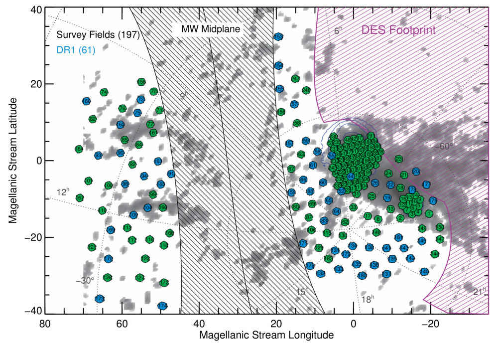
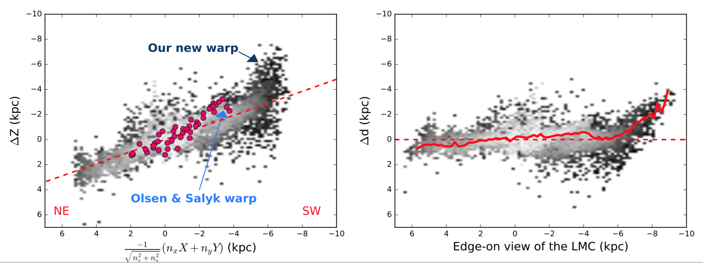
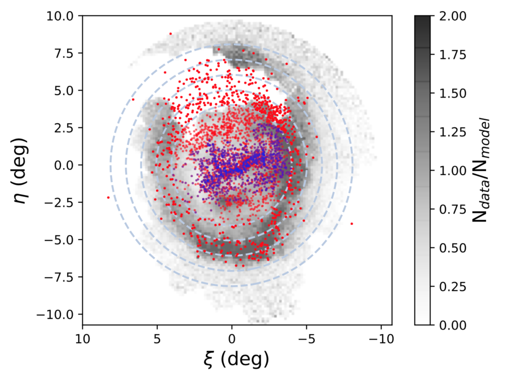

<figure>

<figcaption class="centered-text"> Nidever et al. (2017) </figcaption>
</figure>

The Survey of the MAgellanic Stellar History (SMASH) maps ~480 square degrees of the sky to depths of ugriz=24 to detect stellar populations associated with the Magellanic Clouds. Our team has been producing [exciting results](https://datalab.noao.edu/smash/results.php) and made the first data release of ~100 million objects in 2017. The second data release will be in early 2019. The SMASH DR1 is available through [NOAO Data Lab](https://datalab.noao.edu/smash/smash.php). The detailed description of the survey can be found in [Nidever et al. 2017](http://adsabs.harvard.edu/abs/2017AJ....154..199N).  

<figure>

<figcaption>Choi et al. (2018a)</figcaption>
</figure>

In the team, I have been leading several projects on understanding the galactic structure and dust reddening of the Magellanic Clouds. For example, I measured the reddening map and 3D structure of the LMC using the red clump stars. My reddening map is the most accurate and complete for the LMC main body to date. From the measured 3D structure, I detected a stellar warp in the outer disk for the first time. I also found evidence for the tilted bar relative to the rest of the disk in the radial profiles of the disk incliation and position angle of line of nodes. This outer warp and the tilted bar are consistent with the predictions from simulations of a recent (~150-200 Mry ago) direct collision between the LMC and SMC ([Choi et al. 2018a](http://adsabs.harvard.edu/abs/2018ApJ...866...90C)). 

<figure>

<figcaption>Choi et al. (2018b)</figcaption>
</figure>

By modeling the LMC as a two-component (exponential disk and a boxy bar) galaxy in Bayesian inference, I firmly established the existence of the ring-like stellar overdenisty at ~6 degrees from the LMC center, which consists of intermediate to old stellar populations only and shows the maximum amplitude of ~2-2.5 times higher than the underlying smooth disk ([Choi et al. 2018b](http://adsabs.harvard.edu/abs/2018arXiv180500481C)). Such a ring-like overdensity can be produce via close tidal interactions with the SMC over time. The properties of the overdensity can provide important constraints on the dynamical evolution of the LMC-SMC pair, such as the impact parameter, LMC-SMC mass ratio, the timing of the impact, and the MW halo mass, etc. This structure might be an evolutionary feature in interacting Magellanic-type galaxies.      

Currently I am working on the SMC galactic structure and indenifying Magellanic stellar populations in the Leading Arm gas by using Gaia proper motion measurements. I also launched a new project to explore the origin of the LMC overdensity using the APOGEE-S Magellanic Clouds data by investigating any differences in metallicity, elemental abundances, radial velocity and rough spectroscopic ages (from [C/N]) of the stars on and off the overdensity structure. I have been involved in severla projects led by other SMASH members (e.g., [Nidever et al. 2018](http://adsabs.harvard.edu/abs/2018arXiv180502671N)). 

 
Data: <a href="https://datalab.noao.edu/smash/smash.php">NOAO Data Lab</a>
