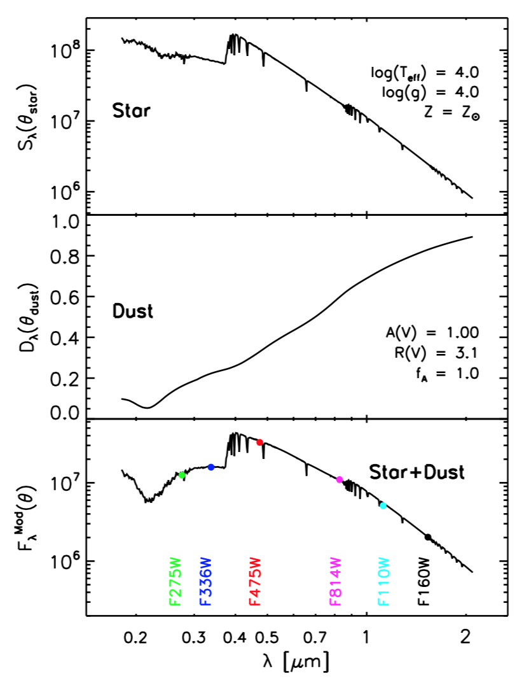
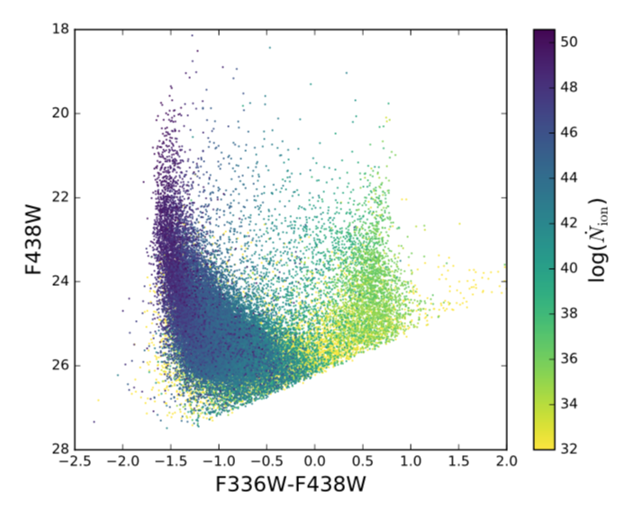

The BEAST is the stellar SED fitting tool that I have been contributing to develop and improve since 2014. The full details of the BEAST are provided by [Gordon et al. 2016](http://adsabs.harvard.edu/abs/2016ApJ...826..104G).

I have specifically used the BEAST to measure the line-of-sight dust extinction and to infer the intrinsic ionizing photons from individual stars in NGC 4214, a nearby starburst galaxy that is an excellent analog of high-z star-forming dwarf galaxies. Recently, ionizing photons escaping from galaxies in the early Universe are thought to be the dominant sources for cosmic reionization. In this scenario, dwarf star-forming galaxies release ionizing photons through low-density holes in their clumpy interstellar medium, which were created by supernova explosion. These high energy photons escape from the galaxy and ionize neutral hydrogen in the intergalactic medium. To fully ionize the universe for a given time scale, each galaxy might need to release at least 10-20% of their ionizing photons. However, both simulations and observations have not been very successful to reproduce such a high fraction of escaping ionizing photons (i.e., escape fraction).

I present a new method for measuring the escape fraction of ionizing photons from galaxies using resolved stellar photometry. I apply this technique to a nearby analog for the high-z starbursts thought to be responsible for cosmic reionization. The starburst dwarf galaxy NGC 4214 has been imaged with the high-resolution of WFC3 on HST from the near-UV to the near-IR. These observations yielded measurements of the broad spectral energy distributions (SEDs) for ∼83,000 resolved stars with good photometric quality. We fit these SEDs to infer the intrinsic properties of individual stars and their intervening dust. Then I measure the local escape fraction by comparing the number of intrinsic ionizing photons with the number of ionizing photons that are either absorbed by dust or used to ionize the surrounding neutral hydrogen in individual star-forming regions. I find that the local escape fraction varies significantly across the face of NGC 4214 with much of the ionizing flux escaping through a few channels towards us. By considering the covering fractions for individual star-forming regions, I also measure the global escape fraction. The measured mean global escape fraction is ∼20%, which is one of the highest value reported for local analogs to date. Furthermore, this measurement is at least a factor of ∼20 higher than previous measurements for NGC 4214. These results suggest that spatially-averaged spectroscopy or imaging can underestimate the escape fraction, highlighting the importance of spatial resolution in measuring the ionizing photon escape fraction.

 
Source: <a href="https://github.com/BEAST-Fitting/beast"><i class="large github icon"></i>BEAST</a>
