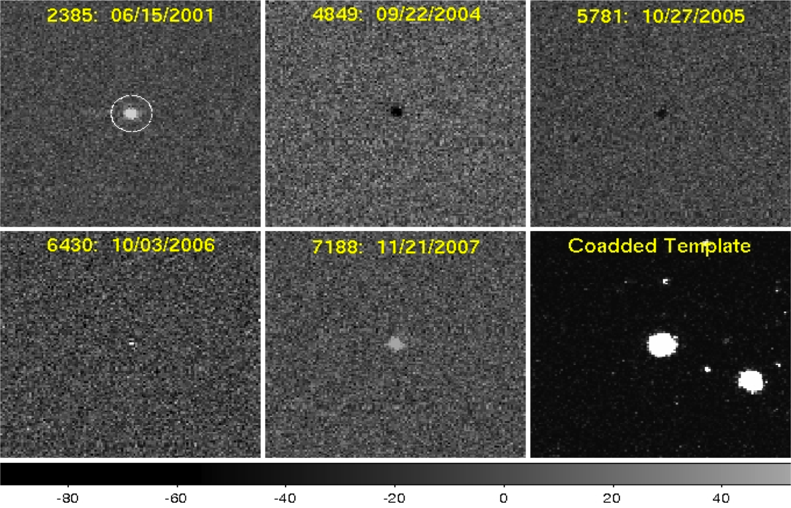
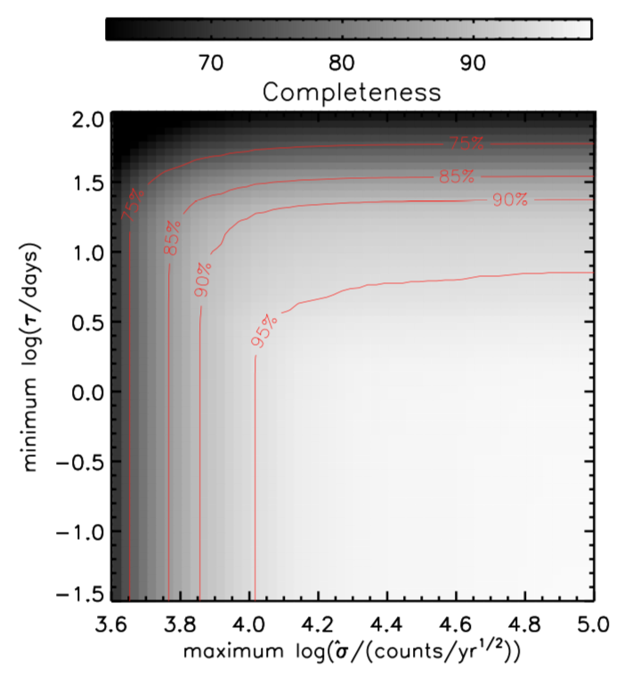
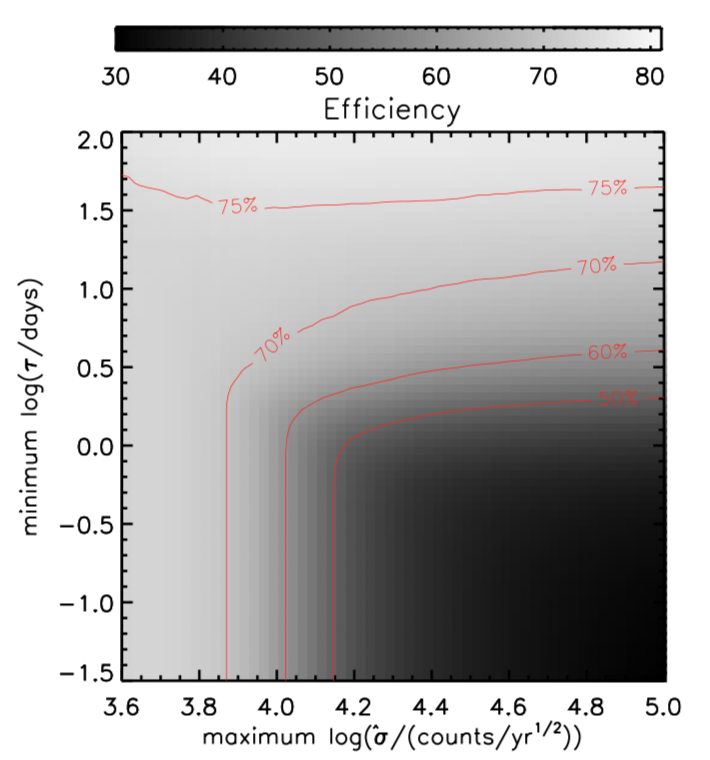

Traditional spectroscopic or photometric selection of active galactic nuclei (AGN) is highly biased towards unresolved luminous quasars. With upcoming all-sky time domain surveys such as the Large Synoptic Survey Telescope (LSST), variability-based AGN selection will enable the construction of highly complete catalogs. Optical AGN light curves are well described by a damped random walk model. In this model, AGN light curves can be simply parameterized by a characteristic damping timescale and amplitude of variability that leaves a distinct signature compared to any other variable sources. Thus, by using image differencing with time domain surveys, we can easily identify variable AGN embedded both in extended galaxies and unresolved luminous quasars.

In [Choi et al. (2014)](http://adsabs.harvard.edu/abs/2014ApJ...782...37C) , we generated 114,653 g-band difference images and constructed light curves for different type of sources in SDSS Stripe 82. Using difference image light curves, we parameterized AGN candidates’ optical variability by the characteristic damping timescale (τ ) and variability amplitude. By virtue of distinguishable variability parameters of AGNs, we were able to select them with high completeness of 93.4% and efficiency (i.e., purity) of 71.3%. We also characterized the optical variability of extended AGN candidates using difference image light curves for the first time, and showed that optical variability is, in fact, a very efficient tool for separating host-dominated AGNs from star-forming galaxies without expensive emission-line ratio diagnostics. Our study showed how successful our faint AGN selection was, and paved the way for future larger time-domain surveys, such as LSST.

