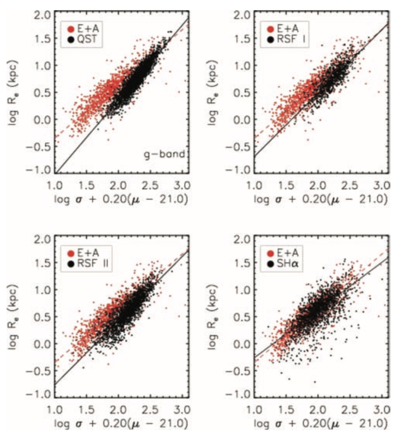
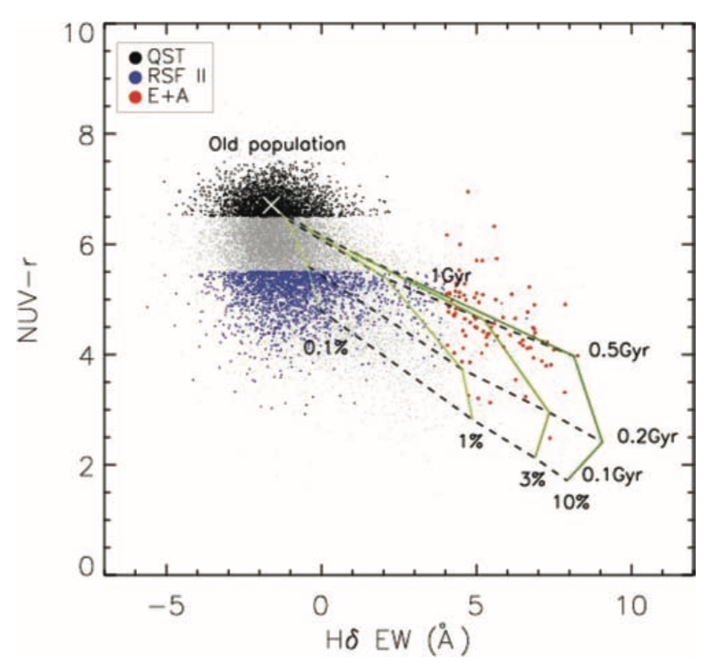

Galaxies are believed to evolve from the blue star-forming stages to the quiescent red sequence via the green valley stage. There is an interesting galaxy group (called E+A galaxies) that suddenly stops forming stars after vigorous star formation. E+As are the key populations for understanding the galaxy evolution because they are believed to be in a transition phase from an actively star-forming blue galaxy to a quiescent red galaxy. To understand how E+A galaxies eventually evolve to their last evolutionary stage, we first identify a new sub-class of galaxy using their distinctive near ultraviolet–optical color. [GALEX](http://www.galex.caltech.edu) found that a significant fraction of early-type galaxies show UV excess that can not be explained even with the strongest UV upturn expected from evolved old stellar populations.

In [Choi et al. (2009)](http://adsabs.harvard.edu/abs/2009MNRAS.395..637C), we examined possible connections between these UV-excess galaxies and post-starburst systems (i.e., E+A galaxies) by comparing their position on the Fundamental Plane (FP), which relates galactic effective radius, effective mean surface brightness, and central velocity dispersion in a two-dimensional manifold. Based on systematic differences in position, slope, and scattering of their FPs, we suggested that early-type galaxies with UV excess are likely the most recent arrivals to the red sequence after undergoing minor star formation (i.e., minor version of E+A), rather than passively evolved E+A galaxies.

